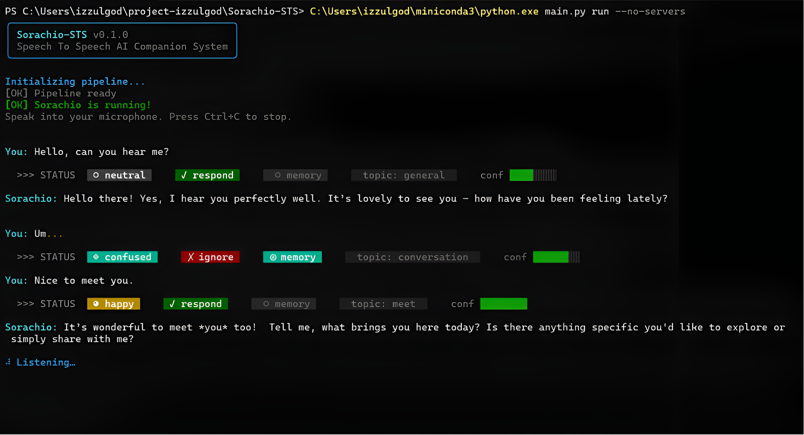

# Sorachio-STS

**Speech To Speech AI Companion System**  
*Foundation for a future robotics companion platform*

---

### System in Action (CLI Showcase)

Here is a preview of how the interactive CLI behaves in voice mode, showcasing the real-time **Cognitive Gateway** status bar and state transitions.

#### 1. Full Voice/Run Mode (`python main.py run`)
In voice mode, the pipeline continuously monitors microphone input using VAD. Once speech is detected and transcribed, the Cognitive Gateway immediately computes the emotional state and topic, seamlessly transitioning into the streaming audio playback phase. Filler or hesitant speech (e.g., "Um...") is filtered out and marked as `X ignore`.



#### 2. Interactive Text Mode (`python main.py text`)
In text mode, you can chat with the companion using keyboard inputs. Perfect for testing prompts and observing Cognitive Gateway filtering without needing a microphone.


---

## Table of Contents

1. [Project Overview](#1-project-overview)
2. [Architecture Diagram](#2-architecture-diagram)
3. [Data Flow](#3-data-flow)
4. [Folder Structure](#4-folder-structure)
5. [Threading Model](#5-threading-model)
6. [Installation](#6-installation)
7. [Model Setup](#7-model-setup)
8. [Running the System](#8-running-the-system)
9. [Configuration Guide](#9-configuration-guide)
10. [Cognitive Gateway Explained](#10-cognitive-gateway-explained)
11. [Acoustic Intelligence Layer](#11-acoustic-intelligence-layer)
12. [Bilingual Language Routing](#12-bilingual-language-routing)
13. [Streaming Pipeline Explained](#13-streaming-pipeline-explained)
14. [Memory Architecture](#14-memory-architecture)
15. [CLI Reference](#15-cli-reference)
16. [MBG System](#16-mbg-system)
17. [Troubleshooting](#17-troubleshooting)
18. [Future Robotics Expansion](#18-future-robotics-expansion)

---

## 1. Project Overview

Sorachio-STS is a **complete, local-first, real-time Speech-to-Speech (STS) AI Companion** system. It runs entirely on your local machine — no cloud APIs, no subscriptions, no data sent anywhere.

The system is designed from the ground up as a **scalable AI companion operating system** — with architecture that anticipates future expansion into robotics, multi-agent systems, cameras, sensors, and ROS2 integration.

### Key Properties

| Property | Detail |
|----------|--------|
| **Fully Local** | All inference runs on-device via llama.cpp + faster-whisper + Kokoro TTS / Piper TTS |
| **Real-Time Streaming** | TTS begins before LLM finishes generating |
| **Two-LLM Architecture** | Cognitive Gateway (LLM #1) + Personality Core (LLM #2) |
| **Model-Agnostic** | Auto-detects any GGUF model — just drop and restart |
| **Vision Ready** | LLM #2 supports multimodal input via mmproj projector |
| **Bilingual** | Automatic English / Indonesian language detection & voice routing |
| **Interruptible** | VAD-based barge-in stops playback instantly; self-interrupt shielded |
| **Persistent Memory** | Remembers you across sessions (JSON file) |
| **Modular** | Each component is a separate async worker |
| **Rich CLI UI** | Transient spinners, animated loaders, and cognitive status pills |
| **Cross-Platform** | Works on macOS, Linux, and Windows |

### Current Model Configuration

| Slot | Model | Size | Role | Notes |
|------|-------|------|------|-------|
| LLM #1 | Qwen3.5-0.8B (Q8_0) | 774 MB | Cognitive Gateway (JSON router) | No vision |
| LLM #2 | Qwen3.5-2B (Q8_0) | ~1.9 GB | Personality Core (conversation) | **Vision** via mmproj |
| STT | faster-whisper small | ~484 MB | Speech-to-Text (multilingual) | Auto ID/EN language detection |
| TTS (EN) | Kokoro-82M (`af_heart`) | ~300 MB | English female voice | PyTorch/ONNX, 24kHz native |
| TTS (ID) | Piper `id_ID-news_tts-medium` | ~67 MB | Indonesian female voice | ONNX, 22.05kHz -> 24kHz resampled |

> **Flexible Model Swapping**: LLM models are auto-detected from `models/llm1/` and `models/llm2/` directories. Just drop a new `.gguf` file and restart.

> **STT/TTS Models**: All STT and TTS models are **automatically downloaded on first run** by MBG — no manual setup required.

---

## 2. Architecture Diagram

```
+-------------------------------------------------------------------+
|                    Sorachio-STS Pipeline                          |
|                                                                   |
|  +----------+    +-------------------------------------------+    |
|  |Microphone|───>| Acoustic Gate (RMS/dBFS)                  |    |
|  +----------+    +-------------------------------------------+    |
|                                   |                               |
|                                   v                               |
|                  +-------------------------------------------+    |
|                  | Peak Follower + Playback Gate Shield       |    |
|                  | (blocks speaker bleed during TTS, -15dBFS) |    |
|                  +-------------------------------------------+    |
|                                   |                               |
|                                   v                               |
|                  +---------------+    +---------------------+     |
|                  | AudioCapture  |───>|   STT Queue         |     |
|                  | (VAD + 8-frame|    |   (asyncio.Queue)   |     |
|                  |  pre-roll buf)|    +--------+------------+     |
|                  +---------------+             |                  |
|                        | barge-in              v                  |
|                        v              +---------------------+     |
|               +-----------------+     |   STT Worker        |     |
|               | Interrupt Event |     | (faster-whisper)    |     |
|               +-----------------+     | + text lang verify  |     |
|                                       | + hallucination flt |     |
|                                       +--------+------------+     |
|                                                |transcript        |
|                                                |+ language        |
|                                                v                  |
|                                       +---------------------+     |
|                                       |  Cognitive Worker   |     |
|                                       |  LLM #1             |     |
|                                       |  (auto-detected)    |     |
|                                       |  JSON decision      |     |
|                                       +--------+------------+     |
|                                                | decision         |
|                                                | + detected_lang  |
|                                                v                  |
|                           +-------------------------------+        |
|                           |       Memory System           |        |
|                           |  STM (in-memory) + LTM (JSON)|        |
|                           +---------------+---------------+        |
|                                           | context               |
|                                           v                       |
|                           +-------------------------------+        |
|                           |       Context Manager         |        |
|                           | system prompt + STM + LTM +   |        |
|                           | [Spoken Language: EN/ID]      |        |
|                           +---------------+---------------+        |
|                                           | messages[]            |
|                                           v                       |
|                           +-------------------------------+        |
|                           |     Personality Worker        |        |
|                           |  LLM #2 (auto-detected)       |        |
|                           |  Streaming token generation   |        |
|                           |  Vision input (if mmproj)     |        |
|                           +---------------+---------------+        |
|                                           | token stream          |
|                                           v                       |
|                           +-------------------------------+        |
|                           |      Chunk Assembler          |        |
|                           |  sentence boundary detection  |        |
|                           +---------------+---------------+        |
|                                           | speech chunks         |
|                                           v                       |
|                           +-------------------------------+        |
|                           |  TTS Worker (Kokoro + Piper)  |        |
|                           |  EN text -> Kokoro (af_heart) |        |
|                           |  ID text -> Piper (id_ID-news) |        |
|                           +---------------+---------------+        |
|                                           | audio arrays          |
|                                           v                       |
|                           +-------------------------------+        |
|                           |   Audio Playback Queue        |        |
|                           |  (interruptible, sounddevice) |        |
|                           +---------------+---------------+        |
|                                           v                       |
|                                       +-------+                   |
|                                       |Speaker|                   |
|                                       +-------+                   |
+-------------------------------------------------------------------+
```

### Server Architecture

```
Python Orchestrator (asyncio event loop)
|
+-- HTTP -> llama-server :8001  -- LLM #1 Cognitive Gateway (auto-detected GGUF)
+-- HTTP -> llama-server :8002  -- LLM #2 Personality Core (auto-detected GGUF + mmproj)
+-- In-process -> faster-whisper -- STT (multilingual small model, offline)
+-- In-process -> Kokoro / Piper -- TTS (Kokoro EN 24kHz + Piper ID 22.05kHz->24kHz)
```

---

## 3. Data Flow

```
[User speaks]
    |
    v PCM bytes (16kHz, 16-bit mono)
[Acoustic Gate] -- drops frames below -45 dBFS
    |
    v
[Peak Follower + Playback Gate Shield]
    | during TTS: threshold = max(-15.0 dBFS, speaker_peak + 7.0 dB)
    | blocks speaker bleed, prevents self-interruption
    |
    v VAD Ring Buffer (8-frame pre-history)
[webrtcvad] -- speech segment with onset consonants preserved
    |
    v audio bytes
[STT Worker: faster-whisper]
    |  Language detection: audio classifier + text-level verifier
    |  Hallucination filter (noise, repetition, domain names)
    |  local_files_only=True -- instant offline load
    v transcript + verified_language
[Cognitive Worker: LLM #1]
    |  POST /v1/chat/completions to llama-server:8001
    |  --reasoning off
    v JSON: {respond, emotion, topic, store_memory, importance, memory_queries}
    + detected_language injected by pipeline
    |
[Context Manager]
    |  STM + LTM retrieval
    |  Emotional context injection
    |  [Spoken Language: English. You MUST respond in English.]  <- per-turn directive
    v messages[]
[Personality Worker: LLM #2]
    |  POST /v1/chat/completions (stream=true) to llama-server:8002
    v token stream
[Chunk Assembler]
    v speech chunks
[Hybrid TTS Client]
    |  Text language detected -> engine selected
    |  en text -> Kokoro TTS (hexgrad/Kokoro-82M, af_heart)
    |  id text -> Piper TTS (id_ID-news_tts-medium)
    v audio arrays
[Playback Queue] -> Speaker
```

---

## 4. Folder Structure

```
Sorachio-STS/
|
+-- main.py                 # Entry point (MBG runs automatically)
+-- mbg.py                  # Master Bootstrap Guardian (build + model downloads)
+-- pyproject.toml          # Ruff + pyrefly configuration
+-- README.md
|
+-- config/
|   +-- sorachio.yaml       # Master config (edit this!)
|   +-- settings.py         # Pydantic settings loader + model auto-scanner
|
+-- core/
|   +-- pipeline.py         # Master async pipeline (STT lang routing, interrupt)
|   +-- events.py           # Event bus (pub/sub)
|
+-- audio/
|   +-- capture.py          # Mic capture + VAD + peak follower + pre-roll ring buffer
|   +-- playback.py         # Interruptible playback queue
|   +-- acoustic_gate.py    # Pre-VAD energy filter + silence sentinel injection
|   +-- echo_cancellation.py # AEC scaffold (null passthrough by default)
|
+-- vision/
|   +-- capture.py          # Webcam snapshot capture (OpenCV)
|
+-- stt/
|   +-- whisper_client.py   # faster-whisper in-process client
|                           #  - Audio language classifier + text-level verifier
|                           #  - Hallucination filter (noise, repetition, domains)
|                           #  - Pre-trigger ring buffer (onset capture)
|                           #  - local_files_only=True (offline load, no deadlock)
|
+-- tts/
|   +-- kokoro_client.py    # Hybrid Kokoro & Piper TTS client
|                           #  - Kokoro TTS for English (af_heart, 24kHz)
|                           #  - Piper TTS for Indonesian (id_ID-news_tts-medium)
|                           #  - Automatic text langdetect + STT language lock
|                           #  - Dynamic resampling to 24kHz
|   +-- piper_client.py     # Piper ONNX fallback client (Indonesian TTS engine)
|
+-- cognition/
|   +-- cognitive_gateway.py  # Model-agnostic JSON decision router
|
+-- llm/
|   +-- llama_client.py     # Async llama-server client (multimodal ready)
|   +-- model_scanner.py    # Auto-detect GGUF models + mmproj
|
+-- context/
|   +-- context_manager.py  # Prompt assembly + per-turn language directive injection
|
+-- memory/
|   +-- short_term.py       # Rolling conversation window
|   +-- long_term.py        # JSON persistent memory + retrieval
|
+-- personality/
|   +-- personality_core.py # Streaming conversation engine (model-agnostic)
|
+-- services/
|   +-- server_manager.py   # llama-server lifecycle (mmproj, jinja, reasoning)
|
+-- utils/
|   +-- logging_setup.py    # Structured logging (Rich + file)
|   +-- chunk_assembler.py  # Token -> speech chunk converter
|
+-- cli/
|   +-- main.py             # All commands (run, text, test-*, ...)
|
+-- models/
|   +-- llm1/               # Drop any GGUF here for Cognitive Gateway
|   +-- llm2/               # Drop any GGUF + optional mmproj here
|   +-- tts/                # Piper ONNX models (auto-downloaded by MBG)
|
+-- bin/
|   +-- llama-server        # llama-server binary (built by MBG or placed manually)
|
+-- data/
|   +-- memory/
|       +-- ltm.json        # Long-term memory (auto-created)
|
+-- logs/
|   +-- sorachio.log
|   +-- cognitivegateway_server.log
|   +-- personalitycore_server.log
|
+-- .repos/                 # Cloned repos (auto-managed by MBG)
+-- venv_runtime/           # Virtual environment (auto-created by MBG)
+-- sensors/                # Future: cameras, IMU, LIDAR
+-- actuators/              # Future: motors, servos, LED rings
```

---

## 5. Threading Model

```
Main Thread (asyncio event loop)
|
+-- [asyncio Task] STT Worker           -- awaits stt_queue, runs faster-whisper in executor
+-- [asyncio Task] Cognitive Worker     -- awaits cognitive_queue, HTTP to LLM #1
+-- [asyncio Task] Personality Worker   -- HTTP streaming to LLM #2
+-- [asyncio Task] TTS Worker           -- synthesizes via Piper in thread executor
+-- [asyncio Task] Playback Worker      -- drains audio queue, plays via sounddevice
|
+-- [Thread] VAD Worker                 -- continuous mic monitoring + ring buffer
|   +-- puts audio to stt_queue via run_coroutine_threadsafe()
|
+-- [Thread Executor] Piper Synthesis   -- blocking ONNX inference offloaded
+-- [Thread Executor] Whisper Transcribe -- blocking CTranslate2 inference offloaded
```

---

## 6. Installation

### Path A — Windows (Pre-built Binaries)

#### Step 1 — Install Python 3.10–3.12

Download from [python.org](https://www.python.org/downloads/). Check **"Add Python to PATH"**.

#### Step 2 — Download Pre-built Binaries

Download `llama-server.exe` from [llama.cpp releases](https://github.com/ggerganov/llama.cpp/releases) → latest `llama-*-bin-win-*.zip`. Place `llama-server.exe` and all `.dll` files into the `bin/` folder.

> **Note**: `whisper-cli` is no longer required. faster-whisper runs entirely in-process.

#### Step 3 — Download LLM Models

```
models/
+-- llm1/
|   +-- YourModel.gguf              # Any instruction-following GGUF model
+-- llm2/
|   +-- YourModel.gguf              # Any chat GGUF model
|   +-- mmproj-YourModel.gguf       # Optional: vision projector
```

STT (faster-whisper) and TTS (Piper) models are **auto-downloaded by MBG**.

#### Step 4 — Clone and Run

```powershell
git clone https://github.com/izzulgod/sorachio-sts.git
cd sorachio-sts
python main.py run
```

MBG runs automatically and:
- Creates `venv_runtime/` and installs all Python packages
- Downloads faster-whisper `small` model (~484MB)
- Downloads Piper TTS voices to `models/tts/`

---

### Path B — Linux / macOS (Build from Source)

#### Step 1 — Install Prerequisites

**macOS:**
```bash
brew install python@3.12 git cmake
```

**Linux (Ubuntu/Debian):**
```bash
sudo apt install python3.12 python3.12-venv git cmake build-essential
```

**Linux (Fedora/RHEL):**
```bash
sudo dnf install python3.12 git cmake gcc gcc-c++
```

#### Step 2 — Clone and Run

```bash
git clone https://github.com/izzulgod/sorachio-sts.git
cd sorachio-sts
python main.py run
```

MBG handles everything else automatically:
- Creates virtual environment and installs packages
- Installs system dependencies (Vulkan SDK, PortAudio)
- Clones and compiles `llama.cpp` into `bin/` with Vulkan GPU support
- Downloads faster-whisper `small` and Piper ONNX voices

> First run takes 5–15 minutes due to compilation.

---

### What MBG Downloads Automatically

| Asset | Size | Purpose | Location |
|-------|------|---------|---------|
| faster-whisper-small | ~484 MB | STT model | `~/.cache/huggingface/hub/` |
| Kokoro-82M | ~300 MB | English TTS model (`af_heart`) | `~/.cache/huggingface/hub/` |
| id_ID-news_tts-medium | ~67 MB | Indonesian TTS voice (Piper) | `models/tts/` |

LLM models are **user-managed** — download from Hugging Face and place in `models/llm1/` or `models/llm2/`.

---

## 7. Model Setup

### Swapping LLM Models (Drop & Go)

1. **Download** a GGUF model from [Hugging Face](https://huggingface.co/models?library=gguf)
2. **Drop** into `models/llm1/` or `models/llm2/`
3. **Restart** — auto-detected!

```bash
cp ~/Downloads/Qwen3.5-2B-Q8_0.gguf models/llm2/
cp ~/Downloads/mmproj-Qwen3.5-2B-BF16.gguf models/llm2/  # optional vision
python main.py run
```

### Auto-Detection Logic

| Feature | How it works |
|---------|-------------|
| LLM model file | Largest `.gguf` in the directory (excluding mmproj) |
| Vision projector | Any `mmproj*.gguf` in the same directory |
| Context size | Read from GGUF metadata (`--ctx-size 0`) |
| Chat template | Read from GGUF metadata (`--jinja`) |

### STT Model Options

| Model | Size | Accuracy |
|-------|------|----------|
| tiny | ~75 MB | Low |
| base | ~148 MB | Medium |
| **small** | **~484 MB** | **High (default)** |
| medium | ~1.5 GB | Highest |

Change in `config/sorachio.yaml` → `stt.model_size`.

---

## 8. Running the System

```bash
# Full voice mode
python main.py run

# Text mode (no microphone)
python main.py text

# Single message test
python main.py text -m "Hello Sorachio, how are you?"
```

---

## 9. Configuration Guide

All configuration lives in `config/sorachio.yaml`.

### Key Settings

```yaml
# Companion personality
context:
  companion_name: "Sorachio"
  personality_prompt: |
    You are Sorachio, a close human friend of the user. Created by IzzulGod.
    ...

# STT settings
stt:
  model_size: "small"      # tiny | base | small | medium
  language: "auto"         # "auto" = bilingual EN/ID
  beam_size: 2             # 1=fastest, 5=most accurate

# TTS settings
tts:
  voice: "af_heart"        # Default Kokoro voice for English
  speed: 1.0
  sample_rate: 24000       # Native Kokoro output rate (24kHz)
  lang: "auto"             # Routes by detected text language automatically

# LLM creativity
llm:
  personality_core:
    temperature: 0.7
    max_tokens: 200        # Shorter = faster streaming

# GPU acceleration
llm:
  cognitive_gateway:
    n_gpu_layers: 99
  personality_core:
    n_gpu_layers: 99

# Acoustic gate (adjust for your room noise)
audio:
  capture:
    acoustic_gate:
      threshold_dbfs: -45.0    # -50=sensitive, -30=noisy room

# Memory
memory:
  long_term:
    importance_threshold: 0.5
```

---

## 10. Cognitive Gateway Explained

**LLM #1** is a fast routing and filtering brain — it **never generates conversation**, only makes structured JSON decisions in <500ms.

### Input / Output

```
Input: "Hey Sorachio, I've been really stressed about my exams."

Output JSON:
{
    "respond": true,
    "topic": "exams",
    "emotion": "anxious",
    "store_memory": true,
    "importance": 0.8,
    "memory_queries": ["exams", "stress"]
}
```

The pipeline then injects `detected_language` before passing to Context Manager.

### Status UI

```
  >>> STATUS   ◕ happy      ✓ respond      ⚡ medium       ○ memory       topic: greeting
```

---

## 11. Acoustic Intelligence Layer

### 1. Acoustic Gate

Every frame is energy-checked before reaching VAD. Frames below `-45.0 dBFS` are immediately dropped — no wasted STT/LLM cycles on silence.

### 2. Pre-Trigger Ring Buffer (Onset Capture)

The VAD worker maintains a rolling **8-frame (~240ms) history**. When VAD fires, these frames are prepended to the segment — preserving onset consonants of the first word (e.g., the "C" in "Coba lihat").

### 3. Peak Follower + Playback Gate Shield

During TTS playback, the gate threshold is tracked by a **peak follower with slow decay** (-0.2 dB/frame). Minimum cap: **-15.0 dBFS**. Typical speaker bleed (-17 to -19 dBFS) stays safely below this — preventing self-interruptions.

### 4. Playback Pre-Roll Warmup

On TTS start, the gate is forced to `-10.0 dBFS` for 6 frames (180ms) to let the audio driver buffer stabilize without false interrupts.

---

## 12. Bilingual Language Routing

Sorachio-STS handles automatic **English ↔ Indonesian** routing at four independent levels:

### Level 1: Audio Language Classifier (faster-whisper)

Sums Indonesian-family probabilities (`id`, `ms`, `jw`, `su`) with a 3x bias correction:
- Routes to Indonesian if `corrected_id_prob > en_prob AND raw_id_prob > 0.20`
- Otherwise falls back to English

### Level 2: Text-Level Language Verification

Whisper's audio classifier has a known bug: English words starting with "In-" ("Introduce", "Inside") get misclassified as `id` (Indonesian).

After transcription, `_verify_text_language()` checks the **decoded text**:
- Indonesian keyword match → `id`
- `langdetect` returns English → corrects to `en`

This completely fixes the "Introduce yourself → Indonesian response" bug.

### Level 3: Per-Turn LLM Directive

The Context Manager injects a strict turn-level language directive:
- English input → `[Spoken Language: English. You MUST respond in English.]`
- Indonesian input → `[Spoken Language: Indonesian. You MUST respond in Indonesian.]`

### Level 4: Hybrid TTS Engine Routing

- English text → Kokoro TTS (`hexgrad/Kokoro-82M`, voice: `af_heart`, 24kHz)
- Indonesian text → Piper TTS (`id_ID-news_tts-medium`, 22.05kHz -> 24kHz resampled)

---

## 13. Streaming Pipeline Explained

Sorachio begins **speaking before it finishes thinking**:

```
LLM #2: "Hello " -> "there! " -> "I " -> "can " -> "hear " -> "you." -> ...
                                                                |
Chunk Assembler:    ["Hello there!"]         ["I can hear you."]
                          |                          |
TTS Synthesis:      audio1 ready         audio2 synthesizing...
                          |
Audio Queue:        [audio1] -> speaker
                               (while playing) [audio2] -> queued -> next
```

**First audio** is typically heard within **0.5–1.5 seconds** of LLM starting.

---

## 14. Memory Architecture

### Short-Term Memory (STM)

- In-memory rolling deque, last 20 messages
- Content: role, content, emotion, topic, importance, timestamp
- Cleared on session end

### Long-Term Memory (LTM)

- JSON file (`data/memory/ltm.json`), up to 500 entries
- Keyword matching + importance scoring + recency weighting
- Persists across sessions

---

## 15. CLI Reference

```bash
# Full voice mode
python main.py run [--config path] [--no-greeting] [--no-servers]

# Interactive text mode
python main.py text [--config path] [--no-servers]

# Single message test
python main.py text --message "Hello Sorachio"

# Test individual components
python main.py test-stt [--file audio.wav]
python main.py test-tts "Hello, I am Sorachio!"
python main.py test-cognitive "Hey Sorachio, I feel tired"

# Server management
python main.py servers status
python main.py servers start
python main.py servers stop

# Memory management
python main.py memory list
python main.py memory clear [--yes]
```

---

## 16. MBG System

### What is MBG?

**MBG: Master Bootstrap Guardian** — automated build and compatibility system for Sorachio-STS.

### Features

- Python 3.10–3.12 version management and auto-relaunch
- Creates and manages `venv_runtime/` virtual environment
- Installs Python packages + system dependencies (Vulkan, PortAudio)
- Builds `llama-server` from source (Linux/macOS) with Vulkan GPU offload
- Applies `cap_ipc_lock` for zero-swap RAM locking on Linux
- Downloads `faster-whisper-small` STT model and `Kokoro-82M` English TTS model to HuggingFace cache
- Downloads Piper ONNX Indonesian TTS voice (`id_ID-news_tts-medium`) to `models/tts/`
- Auto-detects GGUF models and vision projectors

### Commands

```bash
python mbg.py           # Full bootstrap
python mbg.py --check   # Check system status
python mbg.py --force   # Force rebuild everything
python mbg.py --models  # Download STT/TTS models only
python mbg.py --build   # Build binaries only
python mbg.py --version # Show version
```

---

## 17. Troubleshooting

### "Binary not found" / llama-server missing

On Windows: binary must be `llama-server.exe` in `bin/`. Run `python mbg.py --check` to verify.

### Sorachio interrupts itself during playback

The Playback Gate Shield holds the threshold at `max(-15.0 dBFS, speaker_peak + 7.0 dB)`. If self-interruption still occurs, raise the minimum in `audio/capture.py`:
```python
playback_thresh = max(-13.0, self._speaker_baseline_dbfs + 7.0)
```

### "LLM server not responding"

```bash
python main.py servers status
# Check logs:
cat logs/cognitivegateway_server.log
cat logs/personalitycore_server.log
```

### "Audio device issues"

```yaml
# config/sorachio.yaml
audio:
  capture:
    device_index: 0
  playback:
    device_index: 1
```

List devices:
```bash
python -c "import sounddevice; print(sounddevice.query_devices())"
```

### High latency

1. Enable GPU: `n_gpu_layers: 99` in config
2. Rebuild with Vulkan: `python mbg.py --force --build`
3. Reduce `max_tokens: 150` in personality_core
4. Lock RAM: ensure `cap_ipc_lock` is applied (auto by MBG on Linux)

---

## 18. Future Robotics Expansion

Sorachio-STS is architected as the **brain** of a future companion robot.

### Planned Expansion Modules

| Module | Description | Status |
|--------|-------------|--------|
| `sensors/camera.py` | OpenCV face detection, emotion recognition | Planned |
| `sensors/imu.py` | Accelerometer/gyroscope | Planned |
| `actuators/servo.py` | Facial expression servos | Planned |
| `actuators/led.py` | LED ring for emotional state | Planned |
| `memory/vector_ltm.py` | ChromaDB/FAISS semantic memory | Planned |
| `cognition/vision_gate.py` | Visual cognitive gateway | Planned |
| `core/ros2_bridge.py` | ROS2 topic publisher/subscriber | Planned |
| `agents/task_agent.py` | Goal-oriented sub-agent | Planned |

### Multi-Agent Architecture (Vision)

```
Sorachio Core Brain
+-- Cognitive Gateway (LLM #1) -- fast JSON routing
+-- Personality Core (LLM #2) -- conversation + vision (mmproj ready)
+-- Vision Agent -- camera + face recognition
+-- Task Agent -- goal planning + execution
+-- Memory Agent -- LTM consolidation + reflection
```

---

## License

MIT License — see [LICENSE](LICENSE)

## Contributing

- Bug fixes and improvements
- New sensor/actuator integrations
- Alternative STT/TTS backends
- Vector database LTM implementation
- ROS2 bridge
