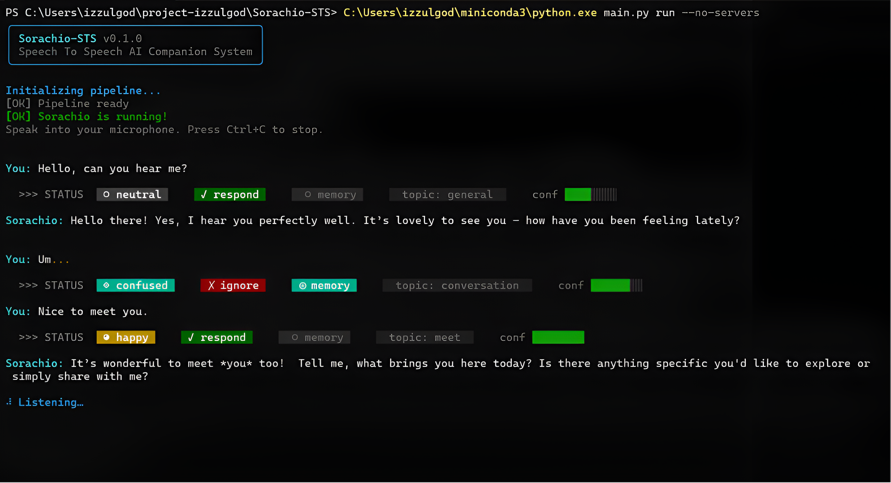

# Sorachio-STS

**Speech To Speech AI Companion & Autonomous Robotics System**  
*Local-first, real-time voice AI companion powered by dual-LLM cognition, wake word detection, agentic action planning, and modular robotics architecture*

Sorachio-STS is a fully local, real-time Speech-to-Speech AI companion that runs entirely on your machine with zero cloud dependencies. It uses a dual-LLM architecture — a fast Cognitive Gateway (LLM #1) for intent routing and emotion detection, and a Personality Core (LLM #2) for natural conversation — with automatic English/Indonesian bilingual support, streaming TTS that speaks before the LLM finishes generating, calibration-based adaptive echo cancellation, ChromaDB vector memory for cross-session recall, and VAD-based barge-in for natural turn-taking. Built as a scalable companion OS designed for future robotics expansion with ROS2 integration, sensor fusion, and multi-agent coordination.

---

### System in Action (CLI Showcase)

Preview of how the interactive CLI behaves in voice mode, showcasing the real-time **Cognitive Gateway Action Badges**, **Wake Word State Transitions**, and state management.

#### 1. Full Voice/Run Mode (`python main.py run`)
In voice mode, the pipeline monitors microphone input in **IDLE Mode** for wake word activation (`alexa`, `hey_jarvis`, `hey_mycroft`, or custom `.onnx`). Upon detection, Sorachio plays an instant audio response ("Hey there!", "I'm listening!", "Hello!"), transitions to **ACTIVE Mode**, processes speech via STT, and uses LLM1 as an **Agentic Action Planner** to execute physical movements or web searches before routing to LLM2.



#### 2. Interactive Text Mode (`python main.py text`)
In text mode, you can interact with the companion using keyboard inputs. Ideal for testing prompts, inspecting Cognitive Gateway JSON action decisions, and validating tool dispatching without a microphone.


---

## Table of Contents

1. [Project Overview](#1-project-overview)
2. [Architecture Diagram](#2-architecture-diagram)
3. [Data Flow](#3-data-flow)
4. [Folder Structure](#4-folder-structure)
5. [Threading & State Model](#5-threading--state-model)
6. [Installation](#6-installation)
7. [Model Setup](#7-model-setup)
8. [Wake Word Engine](#8-wake-word-engine)
9. [Agentic Action Engine & Robotics HAL](#9-agentic-action-engine--robotics-hal)
10. [Running the System](#10-running-the-system)
11. [Configuration Guide](#11-configuration-guide)
12. [Cognitive Gateway & Action Planning](#12-cognitive-gateway--action-planning)
13. [Acoustic Intelligence Layer](#13-acoustic-intelligence-layer)
14. [Bilingual Language Routing](#14-bilingual-language-routing)
15. [Streaming Pipeline Explained](#15-streaming-pipeline-explained)
16. [Memory Architecture](#16-memory-architecture)
17. [CLI Reference](#17-cli-reference)
18. [MBG System](#18-mbg-system)
19. [Troubleshooting](#19-troubleshooting)
20. [Future Robotics Expansion](#20-future-robotics-expansion)

---

## 1. Project Overview

Sorachio-STS is a **complete, 100% local-first, real-time Speech-to-Speech (STS) AI Companion & Autonomous Agent** platform. It runs entirely on your local hardware — no cloud APIs, no subscriptions, no telemetry, and zero mandatory external network calls.

The system is designed from the ground up as a **modular companion operating system** — with architecture optimized to run across standard PCs/laptops or embedded Single Board Computers (SBCs), interfacing with external microcontrollers, sensors, and actuators for embodied robotics.

### Key Properties

| Property | Detail |
|----------|--------|
| **100% Local & Offline** | All inference runs on-device via llama.cpp + openwakeword + faster-whisper + Kokoro / Piper TTS |
| **Real-Time Streaming** | TTS begins audio playback before LLM finishes text generation |
| **Wake Word Engine** | OpenWakeWord detector (`alexa`, `hey_jarvis`, `hey_mycroft`, custom ONNX models) with state machine |
| **Instant Wake Response** | Fast instant audio acknowledgment ("Hey there!", "I'm listening!", "Hello!") on wake trigger |
| **Two-LLM Architecture** | Agentic Action Planner (LLM #1) + Personality Core (LLM #2) |
| **Agentic Action Engine** | Autonomous action execution (`move`, `look`, `search`, `remember`, `multi`) via modular dispatcher |
| **Robotics Modular HAL** | Hardware Abstraction Layer with `MockRobotController` (laptop/dev) and `ESP32RobotController` (serial/HTTP) |
| **Live Web Search** | Optional real-time web search via DuckDuckGo engine (`utils/web_search.py`) |
| **Model-Agnostic** | Auto-detects any GGUF model in `models/llm1/` and `models/llm2/` — drop & restart |
| **Vision Ready** | LLM #2 supports multimodal input via `mmproj` projector |
| **Bilingual** | Automatic English / Indonesian language detection & voice routing |
| **Interruptible** | VAD-based barge-in stops playback instantly; self-interrupt shielded |
| **Adaptive AEC** | Calibration-based room impulse response echo cancellation (3s chirp sweep + Wiener/LMS filter) |
| **Deep Buffer Reset** | OpenWakeWord preprocessor buffer clearing to guarantee zero ghost triggers |
| **Vector Memory** | ChromaDB semantic search + sentence-transformers embeddings for LTM (offline) |
| **Emotion Persistence** | Long-term mood trend detection and emotion pattern tracking |
| **Rate Limiting** | Sliding window algorithm to protect the cognitive pipeline from rapid-fire spikes |
| **Anteque Ashing** | Mandatory Python quality code verifier (`ruff` + `pyrefly`) enforced on bootstrap |
| **Rich CLI UI** | Mode indicators, action status badges, transient spinners, and cognitive pills |

### Current Model Configuration

| Slot | Model | Size | Role | Local Path |
|------|-------|------|------|------------|
| Wake Word | OpenWakeWord ONNX (`alexa`, `hey_jarvis`, etc.) | ~5 MB | Instant wake word detection | `models/wakeword/` |
| LLM #1 | Qwen2.5-Coder-0.5B-Instruct (Q8_0) | ~644 MB | Agentic Action Planner (JSON action router) | `models/llm1/` |
| LLM #2 | Qwen3.5-4B (Q4_K_M) | ~2.6 GB | Personality Core (conversation) + **Vision** | `models/llm2/` |
| STT | faster-whisper medium | ~1.5 GB | Speech-to-Text (multilingual ID/EN, high accuracy) | `models/stt/` |
| TTS (EN) | Kokoro-82M (`af_heart`) | ~327 MB | English female voice — 24kHz native | `models/tts/kokoro/` |
| TTS (ID) | Piper `id_ID-news_tts-medium` | ~67 MB | Indonesian female voice — 22.05kHz→24kHz | `models/tts/` |
| Vector Embed | all-MiniLM-L6-v2 | ~90 MB | Semantic memory embeddings (offline) | `models/vector/all-MiniLM-L6-v2/` |

> **Self-Contained Storage**: All model weights, configurations, and vector databases live inside `models/` and `data/` within the project. Nothing is hidden in `~/.cache`.

---

## 2. Architecture Diagram

```
+-----------------------------------------------------------------------------------+
|                            Sorachio-STS Pipeline                                  |
|                                                                                   |
|  +----------+    +-------------------------------------------+                    |
|  |Microphone|───>| Acoustic Gate (RMS/dBFS)                  |                    |
|  +----------+    +-------------------------------------------+                    |
|                                   |                                               |
|                                   v                                               |
|                  +-------------------------------------------+                    |
|                  | CalibrationAEC / SpectralSubAEC           |                    |
|                  | (3s chirp room calibration, Wiener/LMS)   |                    |
|                  +-------------------------------------------+                    |
|                                   |                                               |
|                                   v                                               |
|                  +-------------------------------------------+                    |
|                  | AudioCapture State Machine                |                    |
|                  | (IDLE vs ACTIVE + 2.5s Cooldown Guard)     |                    |
|                  +--------------------+----------------------+                    |
|                                       |                                           |
|            +--------------------------+--------------------------+                |
|            | IDLE Mode                                           | ACTIVE Mode    |
|            v                                                     v                |
|  +-------------------+                                   +---------------+        |
|  | WakeWordDetector  |                                   |  STT Queue     |        |
|  | (openwakeword)    |                                   | (asyncio)     |        |
|  +---------+---------+                                   +-------+-------+        |
|            | Trigger detected                                    |                |
|            v                                                     v                |
|  +-------------------+                                   +---------------+        |
|  | Instant TTS Audio |                                   | STT Worker    |        |
|  | ("Hey there!")    |                                   | (Whisper)     |        |
|  +-------------------+                                   +-------+-------+        |
|                                                                  | transcript     |
|                                                                  v                |
|                                                          +---------------+        |
|                                                          | ActionPlanner |        |
|                                                          | (LLM #1)      |        |
|                                                          +-------+-------+        |
|                                                                  | JSON action    |
|                                                                  v                |
|                                                          +---------------+        |
|                                                          | Action        |        |
|                                                          | Dispatcher    |        |
|                                                          +--+---+---+----+        |
|                                                             |   |   |             |
|                                      +----------------------+   |   +------+      |
|                                      |                          |          |      |
|                                      v                          v          v      |
|                            +-------------------+          +----------+ +----+     |
|                            | Actuators (HAL)   |          | WebSearch| |LTM |     |
|                            | Mock / Micro-     |          | (DuckDuck| |Vector    |
|                            | controller (Move) |          |  Go)     | |Memory    |
|                            +-------------------+          +----------+ +----+     |
|                                                                            |      |
|                                                                            v      |
|                                                          +---------------+        |
|                                                          | Personality   |        |
|                                                          | Worker        |        |
|                                                          | (LLM #2)      |        |
|                                                          +-------+-------+        |
|                                                                  | stream         |
|                                                                  v                |
|                                                          +---------------+        |
|                                                          | Hybrid TTS    |        |
|                                                          | Kokoro / Piper|        |
|                                                          +-------+-------+        |
|                                                                  | audio          |
|                                                                  v                |
|                                                              +-------+            |
|                                                              |Speaker|            |
|                                                              +-------+            |
+-----------------------------------------------------------------------------------+
```

---

## 3. Data Flow

```
[User speaks wake word: "Alexa" / "Hey Jarvis" / "Hey Sorachio"]
    |
    v PCM bytes (16kHz, 16-bit mono)
[WakeWordDetector (OpenWakeWord)] -- confidence >= 0.50
    |
    +--> Plays Instant Confirmation ("Hey there!", "I'm listening!", "Hello!")
    +--> State transition: IDLE -> ACTIVE (15-second activity window)
    +--> Deep reset preprocessor buffers to prevent ghost triggers
    |
[User speaks command: "Turn left and search python news"]
    |
[Acoustic Gate & AEC] -- drops ambient noise, cancels room echo
    |
[STT Worker: faster-whisper] -- transcribes audio to text transcript
    |
[Agentic Action Planner: LLM #1]
    |  JSON decision:
    |  {
    |    "action": "multi",
    |    "actions": [
    |      {"action": "move", "direction": "left", "angle_deg": 90},
    |      {"action": "search", "query": "python news"},
    |      {"action": "conversation"}
    |    ]
    |  }
    |
[Action Dispatcher]
    |--> RobotController (Mock / Serial / HTTP) -> Executes motion
    |--> WebSearchEngine (DuckDuckGo) -> Fetches web snippets
    |--> Memory System & Emotion Tracker -> Injects context + search results
    |
[Context Manager & LLM #2 Personality Core]
    |  Generates natural speech output enriched with search & sensory context
    |
[Hybrid TTS Client (Kokoro / Piper)] -> Speaker
```

---

## 4. Folder Structure

```
Sorachio-STS/
|
+-- main.py                 # Entry point (MBG runs automatically)
+-- mbg.py                  # Master Bootstrap Guardian + Anteque Ashing quality checks
+-- pyproject.toml          # Ruff + pyrefly configuration
+-- README.md
|
+-- config/
|   +-- sorachio.yaml       # Master config (edit this!)
|   +-- settings.py         # Pydantic settings loader + model auto-scanner
|
+-- core/
|   +-- pipeline.py         # Master async pipeline (wake word callback, action dispatch)
|   +-- events.py           # Event bus (pub/sub)
|
+-- audio/
|   +-- capture.py          # Mic capture + VAD + wake word state machine + deep reset
|   +-- playback.py         # Interruptible playback queue
|   +-- wakeword.py         # OpenWakeWord wrapper + deep feature buffer clearing
|   +-- acoustic_gate.py    # Pre-VAD energy filter + silence sentinel injection
|   +-- echo_cancellation.py # CalibrationAEC (3s chirp sweep) + SpectralSubAEC + NullAEC
|
+-- actuators/
|   +-- robot_controller.py # Robot Hardware Abstraction Layer (Mock & Microcontroller Serial/HTTP)
|
+-- cognition/
|   +-- cognitive_gateway.py  # Agentic Action Planner (JSON schema prompt builder)
|   +-- action_dispatcher.py  # Action dispatcher (actuators, search, memory, LLM2)
|
+-- utils/
|   +-- web_search.py       # DuckDuckGo instant web search engine
|   +-- logging_setup.py    # Structured logging (Rich + file)
|   +-- chunk_assembler.py  # Token -> speech chunk converter
|   +-- rate_limiter.py     # Sliding window rate limiter
|
+-- vision/
|   +-- capture.py          # Webcam snapshot capture (OpenCV)
|
+-- stt/
|   +-- whisper_client.py   # faster-whisper in-process client
|
+-- tts/
|   +-- kokoro_client.py    # Hybrid Kokoro & Piper TTS client
|   +-- piper_client.py     # Piper ONNX fallback client (Indonesian TTS engine)
|
+-- llm/
|   +-- llama_client.py     # Async llama-server client (multimodal ready)
|   +-- model_scanner.py    # Auto-detect GGUF models + mmproj
|
+-- context/
|   +-- context_manager.py  # Prompt assembly + per-turn language directive injection
|
+-- memory/
|   +-- short_term.py       # Rolling conversation window
|   +-- long_term.py        # Hybrid LTM: JSON persistent storage + VectorStore integration
|   +-- vector_store.py     # ChromaDB vector store + sentence-transformers (all-MiniLM-L6-v2)
|   +-- emotion_tracker.py  # Rolling emotion history & mood trend detection
|
+-- personality/
|   +-- personality_core.py # Streaming conversation engine
|
+-- services/
|   +-- server_manager.py   # llama-server lifecycle
|
+-- cli/
|   +-- main.py             # Rich CLI UI (mode spinners, status badges)
|
+-- models/
|   +-- wakeword/           # OpenWakeWord ONNX models (.onnx + README)
|   +-- llm1/               # Drop any GGUF here for LLM1 Action Planner
|   +-- llm2/               # Drop any GGUF + optional mmproj here for LLM2 Personality
|   +-- stt/                # faster-whisper weights (auto-downloaded by MBG)
|   +-- tts/                # Piper & Kokoro TTS weights (auto-downloaded by MBG)
|   +-- vector/             # sentence-transformers embeddings (auto-downloaded by MBG)
|
+-- bin/
|   +-- llama-server        # llama-server binary (Vulkan GPU support)
|
+-- data/
|   +-- memory/             # ltm.json + ChromaDB vector embeddings
|
+-- logs/                   # Log outputs
+-- venv_runtime/           # Managed virtual environment
```

---

## 5. Threading & State Model

```
Main Thread (asyncio event loop)
|
+-- [asyncio Task] Pipeline Loop        -- manages STT, Action Dispatcher, LLM2, TTS
+-- [asyncio Task] Cognitive Worker     -- LLM #1 Action Planner (JSON generation)
+-- [asyncio Task] Action Dispatcher    -- routes physical moves, web search & memory
+-- [asyncio Task] Personality Worker   -- LLM #2 streaming speech output
+-- [asyncio Task] TTS Worker           -- Kokoro/Piper audio synthesis
|
+-- [Thread] VAD & WakeWord Worker      -- continuous audio capture loop
|   +-- Mode: IDLE   --> passes PCM to OpenWakeWord detector
|   +-- Mode: ACTIVE --> passes PCM to webrtcvad & STT queue
|
+-- [Thread Executor] Blocking ONNX/CTranslate2 (Whisper, Piper, OpenWakeWord)
```

---

## 6. Installation

### Path A — Linux / macOS (Build from Source)

#### Step 1 — Install Prerequisites

**Ubuntu / Debian:**
```bash
sudo apt update && sudo apt install -y python3.12 python3.12-venv git cmake build-essential libportaudio2
```

**Fedora / RHEL:**
```bash
sudo dnf install -y python3.12 git cmake gcc gcc-c++ portaudio-devel
```

**macOS:**
```bash
brew install python@3.12 git cmake portaudio
```

#### Step 2 — Clone and Run

```bash
git clone https://github.com/izzulgod/sorachio-sts.git
cd sorachio-sts
python main.py run
```

MBG handles everything automatically:
- Creates `venv_runtime/` virtual environment
- Installs Python packages + Anteque Ashing verification (`ruff` + `pyrefly`)
- Compiles `llama.cpp` binary into `bin/` with Vulkan GPU acceleration
- Auto-downloads STT (Whisper), TTS (Kokoro/Piper), Vector Embedding, and Wake Word models

---

### Path B — Windows (Pre-built Binaries)

#### Step 1 — Install Python 3.10–3.12
Download from [python.org](https://www.python.org/downloads/). Ensure **"Add Python to PATH"** is checked.

#### Step 2 — Download llama-server
Download prebuilt `llama-server.exe` from [llama.cpp releases](https://github.com/ggerganov/llama.cpp/releases) and place `llama-server.exe` and its `.dll` files into `bin/`.

#### Step 3 — Clone and Run
```powershell
git clone https://github.com/izzulgod/sorachio-sts.git
cd sorachio-sts
python main.py run
```

---

## 7. Model Setup

### Swapping LLM Models (Drop & Go)

1. **Download** any GGUF model from Hugging Face.
2. **Place GGUF files**:
   - `models/llm1/`: Cognitive Gateway Action Planner (e.g. `qwen2.5-coder-0.5b-instruct-q8_0.gguf`)
   - `models/llm2/`: Personality Core + Vision (e.g. `Qwen3.5-4B-Q4_K_M.gguf` + `mmproj-BF16.gguf`)
3. **Restart**: `python main.py run` (auto-detected!).

### Auto-Detection Logic

| Feature | How it works |
|---------|-------------|
| LLM model file | Largest `.gguf` in the directory (excluding `mmproj`) |
| Vision projector | Any `mmproj*.gguf` in the same directory |
| Context size | Read from GGUF metadata (`--ctx-size 0`) |
| Chat template | Read from GGUF metadata (`--jinja`) |

---

## 8. Wake Word Engine

Sorachio-STS uses **OpenWakeWord** for real-time, low-latency wake word detection.

### Models Location (`models/wakeword/`)
All wake word models reside locally in `models/wakeword/`:
```
models/wakeword/
+-- alexa_v0.1.onnx
+-- hey_jarvis_v0.1.onnx
+-- hey_mycroft_v0.1.onnx
+-- hey_sorachio.onnx        # Optional custom model
+-- README.md
```

MBG automatically initializes the default ONNX models into `models/wakeword/`. Any custom `.onnx` model placed here will be auto-scanned and loaded at startup.

### Deep Buffer Reset Mechanism
Standard OpenWakeWord `reset()` only clears prediction scores, leaving audio and melspectrogram buffers intact in memory. Sorachio implements a **Deep Reset** in `WakeWordDetector.reset()` that clears `raw_data_buffer`, `feature_buffer` `(116, 96)`, and `melspectrogram_buffer` `(76, 32)`, completely preventing **ghost re-triggers** upon returning to IDLE mode.

---

## 9. Agentic Action Engine & Robotics HAL

LLM #1 (Cognitive Gateway) functions as an **Agentic Action Planner**, outputting structured JSON actions instead of conversational text.

### JSON Action Schema
```json
{
  "action": "multi",
  "actions": [
    {
      "action": "move",
      "direction": "forward",
      "distance_cm": 50,
      "speed": 0.8
    },
    {
      "action": "search",
      "query": "weather forecast"
    },
    {
      "action": "conversation"
    }
  ]
}
```

### Action Types & Handlers

| Action | Payload Parameters | Execution Handler |
|--------|-------------------|-------------------|
| `move` | `direction` (`forward`/`backward`/`left`/`right`), `distance_cm`, `angle_deg`, `speed` | `RobotController.move()` / `rotate()` |
| `look` | `direction` (`up`/`down`/`left`/`right`), `angle_deg` | `RobotController.look()` |
| `search` | `query` | `WebSearchEngine.search()` (DuckDuckGo snippets injected into LLM2) |
| `remember` | `fact`, `importance` | `LongTermMemory.store()` (JSON + ChromaDB) |
| `multi` | `actions: [...]` | Sequential execution of multiple tool calls |
| `conversation` | N/A | Default pass-through to LLM2 streaming |

### Hardware Abstraction Layer (HAL)
- **`MockRobotController`**: Simulates physical actuator behavior in logs for laptop/desktop development.
- **`ESP32RobotController`**: Sends JSON action commands over HTTP or Serial UART to connected microcontrollers or motor controllers.

---

## 10. Running the System

```bash
# Full voice mode (Wake Word + Action Engine + STT + Dual LLM + TTS)
python main.py run

# Interactive text mode (keyboard interface for prompt & action testing)
python main.py text

# Single query text mode
python main.py text --message "search python news"

# Component testing
python main.py test-stt
python main.py test-tts "Testing Kokoro TTS"
python main.py test-cognitive "Turn left and search weather"

# System status check
python mbg.py --check
```

---

## 11. Configuration Guide

All master configurations live in `config/sorachio.yaml`.

```yaml
# Wake Word Configuration
wakeword:
  enabled: true
  target_words: ["hey_sorachio", "alexa", "hey_jarvis", "hey_mycroft"]
  threshold: 0.50
  active_timeout_s: 15.0
  confirmation_sound: true
  model_dir: "models/wakeword"

# Robotics HAL Configuration
robot:
  controller_type: "mock"    # "mock" for local dev, "esp32" for microcontroller serial/HTTP
  esp32_url: "http://192.168.1.100"
  serial_port: "/dev/ttyUSB0"
  baud_rate: 115200

# STT & Acoustic Settings
stt:
  model_size: "medium"
  language: "auto"

audio:
  capture:
    sample_rate: 16000
    chunk_duration_ms: 30
    acoustic_gate:
      threshold_dbfs: -40.0
      enabled: true

# Memory & Vector Store
memory:
  long_term:
    use_vector_store: true
    vector_store_path: "data/memory/chroma"
```

---

## 12. Cognitive Gateway & Action Planning

LLM #1 is optimized for low-latency JSON routing (<300ms). It interprets user intent, emotional tone, and decides whether physical or digital actions are required.

### Terminal Status Badges

```
  >>> STATUS   ◕ happy      ⚡ conversation      ⚡ medium       ○ memory       topic: greeting
```
*(When action is search, an inline query pill is automatically displayed: `⚡ search ... 🔍 query`)*

---

## 13. Acoustic Intelligence Layer

1. **Auto-Calibrated Noise Floor**: Measures ambient background noise for 0.8s on startup and establishes an adaptive noise threshold (`threshold = noise_dbfs + 8.0 dB`, clamped between `-38.0` and `-20.0 dBFS`).
2. **Acoustic Gate (dBFS / RMS)**: Pre-VAD zero-copy energy filter. Frames below the threshold (silence, fan hum, HVAC) are instantly dropped (100% discarded) before reaching the VAD queue, saving CPU compute.
3. **Hold-Frames (Hangover Buffer)**: 15-frame (~450ms) buffer prevents trailing consonants and fading word endings from getting clipped.
4. **Dynamic TTS Playback Clamping**: During TTS playback, dynamically tracks speaker output energy and raises the gate threshold +10.0 dB above speaker baseline with an 8-frame pre-roll shield, eliminating mic echo and self-interruption.
5. **CalibrationAEC**: 3-second room impulse response calibration with LMS/Wiener filtering for acoustic echo cancellation.

---

## 14. Bilingual Language Routing

1. **Audio Language Classifier**: faster-whisper probabilities with 3x Indonesian bias correction.
2. **Text-Level Verification**: `_verify_text_language()` checks text tokens to resolve Whisper "In-" word misclassifications.
3. **Per-Turn Directive**: Context Manager injects explicit `[Spoken Language: English / Indonesian]` prompt directives.
4. **Hybrid Voice Engine**:
   - English text -> Kokoro TTS (`af_heart`, 24kHz)
   - Indonesian text -> Piper TTS (`id_ID-news_tts-medium`, 22.05kHz -> 24kHz resampled)

---

## 15. Streaming Pipeline Explained

```
LLM #2 output:  "Hello " -> "there! " -> "I " -> "am " -> "ready."
                      |                          |
Chunk Assembler:   ["Hello there!"]           ["I am ready."]
                      |                          |
TTS Engine:        Synthesizing chunk 1       Synthesizing chunk 2
                      |                          |
Audio Playback:    Playing chunk 1 ---------> Playing chunk 2
```

First audio chunk is played within **0.5 – 1.2 seconds** of LLM start.

---

## 16. Memory Architecture

- **Short-Term Memory (STM)**: Rolling 20-message in-memory deque.
- **Long-Term Memory (LTM)**: Persistent JSON fact database (`data/memory/ltm.json`).
- **Vector Store**: ChromaDB + `sentence-transformers/all-MiniLM-L6-v2` semantic vector search.
- **Emotion Tracker**: Mood trend analysis and continuous personality adaptation.

---

## 17. CLI Reference

```bash
# Main Modes
python main.py run          # Voice Mode with Wake Word
python main.py text         # Keyboard CLI Mode

# Testing
python main.py test-stt     # Test Whisper STT
python main.py test-tts     # Test Kokoro/Piper TTS
python main.py test-cognitive # Test LLM1 Action Planning

# Server Management
python main.py servers status
python main.py servers start
python main.py servers stop

# Memory Management
python main.py memory list
python main.py memory clear --yes

# MBG Management
python mbg.py --check       # System status check
python mbg.py --force       # Rebuild virtualenv & binaries
python mbg.py --models      # Download/verify model weights only
```

---

## 18. MBG System

**MBG (Master Bootstrap Guardian)** automates system initialization and health checks:
- Python 3.10 – 3.12 environment verification & auto-relaunch
- Virtual environment management (`venv_runtime/`)
- Quality Code Verification: Enforces `ruff check .` and `pyrefly check` on bootstrap (Anteque Ashing)
- Compiles `llama-server` with Vulkan GPU acceleration
- Downloads & verifies faster-whisper, Kokoro, Piper, all-MiniLM, and OpenWakeWord models in `models/`

---

## 19. Troubleshooting

### "Binary not found" / llama-server missing
On Windows: binary must be `llama-server.exe` in `bin/`. Run `python mbg.py --check` to verify.

### Wake Word Ghost Re-triggering
Ensure `audio/wakeword.py` deep reset is active. `WakeWordDetector.reset()` clears all preprocessor buffers on active timeout to eliminate ghost triggers.

### Sorachio interrupts itself during playback
The Playback Gate Shield holds the threshold at `max(-15.0 dBFS, speaker_peak + 7.0 dB)`. If self-interruption occurs, raise the minimum in `audio/capture.py`:
```python
playback_thresh = max(-13.0, self._speaker_baseline_dbfs + 7.0)
```

### "LLM server not responding"
```bash
python main.py servers status
cat logs/cognitivegateway_server.log
cat logs/personalitycore_server.log
```

### Audio device issues
List devices:
```bash
python -c "import sounddevice; print(sounddevice.query_devices())"
```
Configure index in `config/sorachio.yaml`:
```yaml
audio:
  capture:
    device_index: 0
  playback:
    device_index: 1
```

### High latency
1. Enable GPU: `n_gpu_layers: 99` in config.
2. Rebuild with Vulkan: `python mbg.py --force --build`.
3. Reduce `max_tokens: 150` in `personality_core`.

---

## 20. Future Robotics Expansion

Sorachio-STS is designed to act as the primary brain of an autonomous companion robot, adaptable across standard PCs, laptops, and various Single Board Computers (SBCs) connected to microcontrollers:

```
+-------------------------------------------------------------+
|              Main Compute Unit (PC / Laptop / SBC)          |
|                                                             |
|  - Sorachio-STS Runtime (Python 3.12)                       |
|  - llama-server (GGUF LLM1 Action Planner & LLM2)           |
|  - OpenWakeWord + Whisper STT + Kokoro/Piper TTS            |
|  - Web Search Engine & Vector Memory                        |
+------------------------------+------------------------------+
                               |
                               | Serial UART / USB / HTTP
                               v
+-------------------------------------------------------------+
|               Microcontroller / Actuator Driver             |
|                                                             |
|  - Wheel Motors / Rover Drive                               |
|  - Pan-Tilt Head Servos                                     |
|  - Emotional Status LED Indicators                          |
|  - Proximity / Distance Sensors                             |
+-------------------------------------------------------------+
```

### Modular Expansion Roadmap

- [x] `MockRobotController`: Software simulation for local development.
- [x] `ESP32RobotController`: Generic Serial/HTTP protocol for microcontroller actuators.
- [ ] `sensors/camera.py`: Real-time camera feed provider for LLM2 vision.
- [ ] `actuators/led_ring.py`: WS2812B LED emotional status ring controller.
- [ ] `core/ros2_bridge.py`: ROS2 node integration for navigation & SLAM.

---

## License

MIT License — see [LICENSE](LICENSE)
