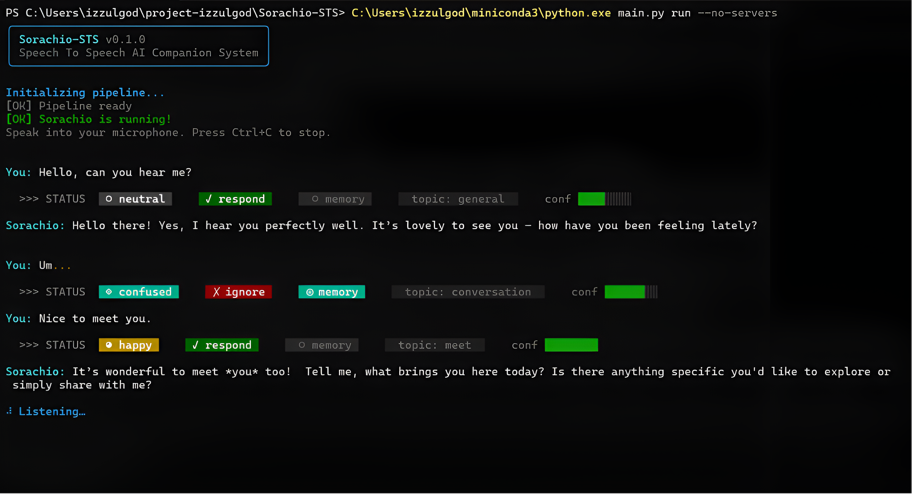

# Sorachio-STS

**Speech To Speech AI Companion & Autonomous Robotics System**  
*Local-first, real-time voice AI companion powered by dual-LLM cognition, wake word detection, agentic action planning, and modular robotics architecture*

Sorachio-STS is a fully local, real-time Speech-to-Speech AI companion that runs entirely on your machine with zero cloud dependencies. It uses a dual-LLM architecture — a fast Cognitive Gateway (LLM #1) for intent routing and emotion detection, and a Personality Core (LLM #2) for natural conversation — with automatic English/Indonesian bilingual support, streaming TTS that speaks before the LLM finishes generating, calibration-based adaptive echo cancellation, ChromaDB vector memory for cross-session recall, and VAD-based barge-in for natural turn-taking. Built as a scalable companion OS designed for future robotics expansion with ROS2 integration, sensor fusion, and multi-agent coordination.

---

### System in Action (CLI Showcase)

Preview of how the interactive CLI behaves in voice mode, showcasing the real-time **Cognitive Gateway Action Badges**, **Wake Word State Transitions**, and state management.

#### 1. Full Voice/Run Mode (`python main.py run`)
In voice mode, the pipeline monitors microphone input in **IDLE Mode** for wake word activation (`alexa`, `hey_jarvis`, `hey_mycroft`, or custom `.onnx`). Upon detection, Sorachio plays an instant audio response ("Hey there!", "I'm listening!", "Hello!"), transitions to **ACTIVE Mode**, processes speech via STT, and uses LLM1 as an **Agentic Action Planner** to execute physical movements or web searches before routing to LLM2.



#### 2. Interactive Text Mode (`python main.py text`)
In text mode, you can interact with the companion using keyboard inputs. Ideal for testing prompts, inspecting Cognitive Gateway JSON action decisions, and validating tool dispatching without a microphone. TTS is **optional** in text mode — off by default, toggle with `/tts`.


---

## Table of Contents

1. [Project Overview](#1-project-overview)
2. [Architecture Diagram](#2-architecture-diagram)
3. [Data Flow](#3-data-flow)
4. [Folder Structure](#4-folder-structure)
5. [Threading & State Model](#5-threading--state-model)
6. [Installation](#6-installation)
7. [Model Setup](#7-model-setup)
8. [Wake Word Engine](#8-wake-word-engine)
9. [Agentic Action Engine & Robotics HAL](#9-agentic-action-engine--robotics-hal)
10. [Running the System](#10-running-the-system)
11. [Configuration Guide](#11-configuration-guide)
12. [Cognitive Gateway & Action Planning](#12-cognitive-gateway--action-planning)
13. [Web Search Engine](#13-web-search-engine)
14. [Acoustic Intelligence Layer](#14-acoustic-intelligence-layer)
15. [Bilingual Language Routing](#15-bilingual-language-routing)
16. [Streaming Pipeline Explained](#16-streaming-pipeline-explained)
17. [Memory Architecture](#17-memory-architecture)
18. [Text Mode Reference](#18-text-mode-reference)
19. [CLI Reference](#19-cli-reference)
20. [MBG System](#20-mbg-system)
21. [Troubleshooting](#21-troubleshooting)
22. [Future Robotics Expansion](#22-future-robotics-expansion)

---

## 1. Project Overview

Sorachio-STS is a **complete, 100% local-first, real-time Speech-to-Speech (STS) AI Companion & Autonomous Agent** platform. It runs entirely on your local hardware — no cloud APIs, no subscriptions, no telemetry, and zero mandatory external network calls.

The system is designed from the ground up as a **modular companion operating system** — with architecture optimized to run across standard PCs/laptops or embedded Single Board Computers (SBCs), interfacing with external microcontrollers, sensors, and actuators for embodied robotics.

### Key Properties

| Property | Detail |
|----------|--------|
| **100% Local & Offline** | All inference runs on-device via llama.cpp + openwakeword + faster-whisper + Kokoro / Piper TTS |
| **Real-Time Streaming** | TTS begins audio playback before LLM finishes text generation |
| **Wake Word Engine** | OpenWakeWord detector (`alexa`, `hey_jarvis`, `hey_mycroft`, custom ONNX models) with state machine |
| **Instant Wake Response** | Fast instant audio acknowledgment ("Hey there!", "I'm listening!", "Hello!") on wake trigger |
| **Two-LLM Architecture** | Agentic Action Planner (LLM #1) + Personality Core (LLM #2) |
| **Agentic Action Engine** | Autonomous action execution (`move`, `look`, `search`, `remember`, `multi`) via modular dispatcher |
| **Robotics Modular HAL** | Hardware Abstraction Layer with `MockRobotController` (laptop/dev) and `ESP32RobotController` (serial/HTTP) |
| **Live Web Search** | Multi-engine ISP-resilient search (Bing → Google News RSS → DuckDuckGo → Wikipedia fallback chain) |
| **Search Indicator** | Animated `🔍 Searching web: "..."` spinner shown in CLI during search execution |
| **Model-Agnostic** | Auto-detects any GGUF model in `models/llm1/` and `models/llm2/` — drop & restart |
| **Vision Ready** | LLM #2 supports multimodal input via `mmproj` projector |
| **Bilingual** | Manual English / Indonesian language selection; runtime toggle via `/lang` command or `L` key |
| **Barge-In** | VAD-based barge-in — disabled by default for open-speaker setups (`enable_interruption: false`) |
| **Adaptive AEC** | Calibration-based room impulse response echo cancellation (3s chirp sweep + Wiener/LMS filter) |
| **Deep Buffer Reset** | OpenWakeWord preprocessor buffer clearing to guarantee zero ghost triggers |
| **Vector Memory** | ChromaDB semantic search + sentence-transformers embeddings for LTM (offline) |
| **Emotion Persistence** | Long-term mood trend detection and emotion pattern tracking |
| **Rate Limiting** | Sliding window algorithm to protect the cognitive pipeline from rapid-fire spikes |
| **Anteque Ashing** | Mandatory Python quality code verifier (`ruff` + `pyrefly`) enforced on bootstrap |
| **Rich CLI UI** | Mode indicators, action status badges, transient spinners, and cognitive pills |

### Current Model Configuration

| Slot | Model | Size | Role | Local Path |
|------|-------|------|------|------------|
| Wake Word | OpenWakeWord ONNX (`alexa`, `hey_jarvis`, etc.) | ~5 MB | Instant wake word detection | `models/wakeword/` |
| LLM #1 | Qwen2.5-Coder-1.5B-Instruct (Q4_K_M) | ~1.1 GB | Agentic Action Planner (JSON action router) | `models/llm1/` |
| LLM #2 | Qwen3.5-4B (Q4_K_M) | ~2.6 GB | Personality Core (conversation) + **Vision** | `models/llm2/` |
| STT | faster-whisper small | ~460 MB | Speech-to-Text (multilingual ID/EN, fast CPU) | `models/stt/` |
| TTS (EN) | Kokoro-82M (`af_heart`) | ~327 MB | English female voice — 24kHz native | `models/tts/kokoro/` |
| TTS (ID) | Piper `id_ID-news_tts-medium` | ~67 MB | Indonesian female voice — 22.05kHz→24kHz | `models/tts/` |
| Vector Embed | all-MiniLM-L6-v2 | ~90 MB | Semantic memory embeddings (offline) | `models/vector/all-MiniLM-L6-v2/` |

> **Self-Contained Storage**: All model weights, configurations, and vector databases live inside `models/` and `data/` within the project. Nothing is hidden in `~/.cache`.

---

## 2. Architecture Diagram

```
+-----------------------------------------------------------------------------------+
|                            Sorachio-STS Pipeline                                  |
|                                                                                   |
|  +----------+    +-------------------------------------------+                    |
|  |Microphone|───>| Acoustic Gate (RMS/dBFS)                  |                    |
|  +----------+    +-------------------------------------------+                    |
|                                   |                                               |
|                                   v                                               |
|                  +-------------------------------------------+                    |
|                  | CalibrationAEC / SpectralSubAEC           |                    |
|                  | (3s chirp room calibration, Wiener/LMS)   |                    |
|                  +-------------------------------------------+                    |
|                                   |                                               |
|                                   v                                               |
|                  +-------------------------------------------+                    |
|                  | AudioCapture State Machine                |                    |
|                  | (IDLE vs ACTIVE + 2.5s Cooldown Guard)     |                    |
|                  +--------------------+----------------------+                    |
|                                       |                                           |
|            +--------------------------+--------------------------+                |
|            | IDLE Mode                                           | ACTIVE Mode    |
|            v                                                     v                |
|  +-------------------+                                   +---------------+        |
|  | WakeWordDetector  |                                   |  STT Queue     |        |
|  | (openwakeword)    |                                   | (asyncio)     |        |
|  +---------+---------+                                   +-------+-------+        |
|            | Trigger detected                                    |                |
|            v                                                     v                |
|  +-------------------+                                   +---------------+        |
|  | Instant TTS Audio |                                   | STT Worker    |        |
|  | ("Hey there!")    |                                   | (Whisper)     |        |
|  +-------------------+                                   +-------+-------+        |
|                                                                  | transcript     |
|                                                                  v                |
|                                                          +---------------+        |
|                                                          | ActionPlanner |        |
|                                                          | (LLM #1)      |        |
|                                                          +-------+-------+        |
|                                                                  | JSON action    |
|                                                                  v                |
|                                                          +---------------+        |
|                                                          | Action        |        |
|                                                          | Dispatcher    |        |
|                                                          +--+---+---+----+        |
|                                                             |   |   |             |
|                                      +----------------------+   |   +------+      |
|                                      |                          |          |      |
|                                      v                          v          v      |
|                            +-------------------+  +------------------+ +----+     |
|                            | Actuators (HAL)   |  | WebSearchEngine  | |LTM |     |
|                            | Mock / Micro-     |  | 4-engine chain:  | |Vec.|     |
|                            | controller (Move) |  | Bing->GNews->    | |Mem.|     |
|                            +-------------------+  | DDG->Wikipedia   | +----+     |
|                                                   +------------------+            |
|                                                          |                        |
|                                                          v                        |
|                                                  +---------------+                |
|                                                  | Personality   |                |
|                                                  | Worker        |                |
|                                                  | (LLM #2)      |                |
|                                                  +-------+-------+                |
|                                                          | stream                 |
|                                                          v                        |
|                                                  +---------------+                |
|                                                  | Hybrid TTS    |                |
|                                                  | Kokoro / Piper|                |
|                                                  +-------+-------+                |
|                                                          | audio                  |
|                                                          v                        |
|                                                      +-------+                    |
|                                                      |Speaker|                    |
|                                                      +-------+                    |
+-----------------------------------------------------------------------------------+
```

---

## 3. Data Flow

```
[User speaks wake word: "Alexa" / "Hey Jarvis" / "Hey Sorachio"]
    |
    v PCM bytes (16kHz, 16-bit mono)
[WakeWordDetector (OpenWakeWord)] -- confidence >= 0.50
    |
    +--> Plays Instant Confirmation ("Hey there!", "I'm listening!", "Hello!")
    +--> State transition: IDLE -> ACTIVE (7-second activity window)
    +--> Deep reset preprocessor buffers to prevent ghost triggers
    |
[User speaks command: "Turn left and search python news"]
    |
[Acoustic Gate & AEC] -- drops ambient noise, cancels room echo
    |
[STT Worker: faster-whisper] -- transcribes audio to text transcript
    |
[Agentic Action Planner: LLM #1]
    |  JSON decision:
    |  {
    |    "action": "multi",
    |    "actions": [
    |      {"action": "move", "direction": "left", "angle_deg": 90},
    |      {"action": "search", "query": "python news"},
    |      {"action": "conversation"}
    |    ]
    |  }
    |
[Action Dispatcher]
    |--> RobotController (Mock / Serial / HTTP) -> Executes motion
    |--> WebSearchEngine (4-engine fallback) -> Fetches web snippets
    |       CLI shows: 🔍 Searching web: "python news"... (animated spinner)
    |--> Memory System & Emotion Tracker -> Injects context + search results
    |
[Context Manager & LLM #2 Personality Core]
    |  Generates natural speech output enriched with search & sensory context
    |
[Hybrid TTS Client (Kokoro / Piper)] -> Speaker
```

---

## 4. Folder Structure

```
Sorachio-STS/
|
+-- main.py                 # Entry point (MBG runs automatically)
+-- mbg.py                  # Master Bootstrap Guardian + Anteque Ashing quality checks
+-- pyproject.toml          # Ruff + pyrefly configuration
+-- README.md
|
+-- config/
|   +-- sorachio.yaml       # Master config (edit this!)
|   +-- settings.py         # Pydantic settings loader + model auto-scanner
|
+-- core/
|   +-- pipeline.py         # Master async pipeline (wake word callback, action dispatch)
|   +-- events.py           # Event bus (pub/sub)
|
+-- audio/
|   +-- capture.py          # Mic capture + VAD + wake word state machine + deep reset
|   +-- playback.py         # Interruptible playback queue
|   +-- wakeword.py         # OpenWakeWord wrapper + deep feature buffer clearing
|   +-- acoustic_gate.py    # Pre-VAD energy filter + silence sentinel injection
|   +-- echo_cancellation.py # CalibrationAEC (3s chirp sweep) + SpectralSubAEC + NullAEC
|
+-- actuators/
|   +-- robot_controller.py # Robot Hardware Abstraction Layer (Mock & Microcontroller Serial/HTTP)
|
+-- cognition/
|   +-- cognitive_gateway.py  # Agentic Action Planner (JSON schema prompt builder)
|   +-- action_dispatcher.py  # Action dispatcher (actuators, search, memory, LLM2)
|
+-- utils/
|   +-- web_search.py       # Multi-engine ISP-resilient search (Bing, Google News RSS, DDG, Wikipedia)
|   +-- logging_setup.py    # Structured logging (Rich + file)
|   +-- chunk_assembler.py  # Token -> speech chunk converter
|   +-- rate_limiter.py     # Sliding window rate limiter
|
+-- vision/
|   +-- capture.py          # Webcam snapshot capture (OpenCV)
|
+-- stt/
|   +-- whisper_client.py   # faster-whisper in-process client + hallucination filter
|
+-- tts/
|   +-- kokoro_client.py    # Hybrid Kokoro & Piper TTS client
|   +-- piper_client.py     # Piper ONNX fallback client (Indonesian TTS engine)
|
+-- llm/
|   +-- llama_client.py     # Async llama-server client (multimodal ready)
|   +-- model_scanner.py    # Auto-detect GGUF models + mmproj
|
+-- context/
|   +-- context_manager.py  # Prompt assembly + per-turn language directive injection
|
+-- memory/
|   +-- short_term.py       # Rolling conversation window
|   +-- long_term.py        # Hybrid LTM: JSON persistent storage + VectorStore integration
|   +-- vector_store.py     # ChromaDB vector store + sentence-transformers (all-MiniLM-L6-v2)
|   +-- emotion_tracker.py  # Rolling emotion history & mood trend detection
|
+-- personality/
|   +-- personality_core.py # Streaming conversation engine
|
+-- services/
|   +-- server_manager.py   # llama-server lifecycle
|
+-- cli/
|   +-- main.py             # Rich CLI UI (mode spinners, status badges, text mode commands)
|
+-- models/
|   +-- wakeword/           # OpenWakeWord ONNX models (.onnx + README)
|   +-- llm1/               # Drop any GGUF here for LLM1 Action Planner
|   +-- llm2/               # Drop any GGUF + optional mmproj here for LLM2 Personality
|   +-- stt/                # faster-whisper weights (auto-downloaded by MBG)
|   +-- tts/                # Piper & Kokoro TTS weights (auto-downloaded by MBG)
|   +-- vector/             # sentence-transformers embeddings (auto-downloaded by MBG)
|
+-- bin/
|   +-- llama-server        # llama-server binary (Vulkan GPU support)
|
+-- data/
|   +-- memory/             # ltm.json + ChromaDB vector embeddings
|
+-- logs/                   # Log outputs
+-- venv_runtime/           # Managed virtual environment
```

---

## 5. Threading & State Model

```
Main Thread (asyncio event loop)
|
+-- [asyncio Task] Pipeline Loop        -- manages STT, Action Dispatcher, LLM2, TTS
+-- [asyncio Task] Cognitive Worker     -- LLM #1 Action Planner (JSON generation)
+-- [asyncio Task] Action Dispatcher    -- routes physical moves, web search & memory
+-- [asyncio Task] Personality Worker   -- LLM #2 streaming speech output
+-- [asyncio Task] TTS Worker           -- Kokoro/Piper audio synthesis
|
+-- [Thread] VAD & WakeWord Worker      -- continuous audio capture loop
|   +-- Mode: IDLE   --> passes PCM to OpenWakeWord detector
|   +-- Mode: ACTIVE --> passes PCM to webrtcvad & STT queue
|
+-- [Thread Executor] Blocking ONNX/CTranslate2 (Whisper, Piper, OpenWakeWord)
```

---

## 6. Installation

### Path A — Linux / macOS (Build from Source)

#### Step 1 — Install Prerequisites

**Ubuntu / Debian:**
```bash
sudo apt update && sudo apt install -y python3.12 python3.12-venv git cmake build-essential libportaudio2
```

**Fedora / RHEL:**
```bash
sudo dnf install -y python3.12 git cmake gcc gcc-c++ portaudio-devel
```

**macOS:**
```bash
brew install python@3.12 git cmake portaudio
```

#### Step 2 — Clone and Run

```bash
git clone https://github.com/izzulgod/sorachio-sts.git
cd sorachio-sts
python main.py run
```

MBG handles everything automatically:
- Creates `venv_runtime/` virtual environment
- Installs Python packages + Anteque Ashing verification (`ruff` + `pyrefly`)
- Compiles `llama.cpp` binary into `bin/` with Vulkan GPU acceleration
- Auto-downloads STT (Whisper), TTS (Kokoro/Piper), Vector Embedding, and Wake Word models

---

### Path B — Windows (Pre-built Binaries)

#### Step 1 — Install Python 3.10–3.12
Download from [python.org](https://www.python.org/downloads/). Ensure **"Add Python to PATH"** is checked.

#### Step 2 — Download llama-server
Download prebuilt `llama-server.exe` from [llama.cpp releases](https://github.com/ggerganov/llama.cpp/releases) and place `llama-server.exe` and its `.dll` files into `bin/`.

#### Step 3 — Clone and Run
```powershell
git clone https://github.com/izzulgod/sorachio-sts.git
cd sorachio-sts
python main.py run
```

---

## 7. Model Setup

### Swapping LLM Models (Drop & Go)

1. **Download** any GGUF model from Hugging Face.
2. **Place GGUF files**:
   - `models/llm1/`: Cognitive Gateway Action Planner (e.g. `qwen2.5-coder-1.5b-instruct-q4_k_m.gguf`)
   - `models/llm2/`: Personality Core + Vision (e.g. `Qwen3.5-4B-Q4_K_M.gguf` + `mmproj-BF16.gguf`)
3. **Restart**: `python main.py run` (auto-detected!).

### Auto-Detection Logic

| Feature | How it works |
|---------|-------------|
| LLM model file | Largest `.gguf` in the directory (excluding `mmproj`) |
| Vision projector | Any `mmproj*.gguf` in the same directory |
| Context size | Read from GGUF metadata (`--ctx-size 0`) |
| Chat template | Read from GGUF metadata (`--jinja`) |

---

## 8. Wake Word Engine

Sorachio-STS uses **OpenWakeWord** for real-time, low-latency wake word detection.

### Models Location (`models/wakeword/`)
All wake word models reside locally in `models/wakeword/`:
```
models/wakeword/
+-- alexa_v0.1.onnx
+-- hey_jarvis_v0.1.onnx
+-- hey_mycroft_v0.1.onnx
+-- hey_sorachio.onnx        # Optional custom model
+-- README.md
```

MBG automatically initializes the default ONNX models into `models/wakeword/`. Any custom `.onnx` model placed here will be auto-scanned and loaded at startup.

### Deep Buffer Reset Mechanism
Standard OpenWakeWord `reset()` only clears prediction scores, leaving audio and melspectrogram buffers intact in memory. Sorachio implements a **Deep Reset** in `WakeWordDetector.reset()` that clears `raw_data_buffer`, `feature_buffer` `(116, 96)`, and `melspectrogram_buffer` `(76, 32)`, completely preventing **ghost re-triggers** upon returning to IDLE mode.

---

## 9. Agentic Action Engine & Robotics HAL

LLM #1 (Cognitive Gateway) functions as an **Agentic Action Planner**, outputting structured JSON actions instead of conversational text.

### JSON Action Schema
```json
{
  "action": "multi",
  "actions": [
    {
      "action": "move",
      "direction": "forward",
      "distance_cm": 50,
      "speed": 0.8
    },
    {
      "action": "search",
      "query": "weather forecast"
    },
    {
      "action": "conversation"
    }
  ]
}
```

### Action Types & Handlers

| Action | Payload Parameters | Execution Handler |
|--------|-------------------|-------------------|
| `move` | `direction` (`forward`/`backward`/`left`/`right`), `distance_cm`, `angle_deg`, `speed` | `RobotController.move()` / `rotate()` |
| `look` | `direction` (`up`/`down`/`left`/`right`), `angle_deg` | `RobotController.look()` |
| `search` | `query` | `WebSearchEngine.search()` (4-engine fallback snippets injected into LLM2) |
| `remember` | `fact`, `importance` | `LongTermMemory.store()` (JSON + ChromaDB) |
| `multi` | `actions: [...]` | Sequential execution of multiple tool calls |
| `conversation` | N/A | Default pass-through to LLM2 streaming |

### Hardware Abstraction Layer (HAL)
- **`MockRobotController`**: Simulates physical actuator behavior in logs for laptop/desktop development.
- **`ESP32RobotController`**: Sends JSON action commands over HTTP or Serial UART to connected microcontrollers or motor controllers.

---

## 10. Running the System

```bash
# Full voice mode (Wake Word + Action Engine + STT + Dual LLM + TTS)
python main.py run

# Interactive text mode (keyboard interface — TTS disabled by default)
python main.py text

# Interactive text mode with TTS enabled from startup
python main.py text --tts

# Single query text mode
python main.py text --message "search python news"

# Component testing
python main.py test-stt
python main.py test-tts "Testing Kokoro TTS"
python main.py test-cognitive "Turn left and search weather"

# System status check
python mbg.py --check
```

---

## 11. Configuration Guide

All master configurations live in `config/sorachio.yaml`.

```yaml
# -----------------------------------------------------------------------
# VAD & Voice Activity Detection (Speech Capture Quality Tuning)
# -----------------------------------------------------------------------
audio:
  capture:
    sample_rate: 16000
    chunk_duration_ms: 30
    silence_timeout_ms: 700     # 700ms — allows natural pauses without chopping speech.
                                # Increase (e.g. 900ms) if speech is still being cut off.
                                # Decrease (e.g. 500ms) for faster response latency.
    min_speech_duration_ms: 450 # 450ms — rejects short background sounds & clicks.
                                # Lower values (e.g. 200ms) accept shorter utterances.
    vad_aggressiveness: 3       # 0-3 (higher = more aggressive noise rejection)
    acoustic_gate:
      enabled: true
      threshold_dbfs: -35.0    # Calibration guide:
                               #   -50 dBFS : very quiet room, sensitive mic
                               #   -40 dBFS : normal room, moderate mic
                               #   -35 dBFS : noisy (fan, TV, background voices)
                               #   -30 dBFS : loud / open speaker setup

# -----------------------------------------------------------------------
# Barge-In / Self-Interruption Control
# -----------------------------------------------------------------------
pipeline:
  enable_interruption: false   # false = disabled for open-speaker setups.
                               # Prevents Sorachio from hearing its own TTS and
                               # triggering a self-interruption loop.
                               # Set to true ONLY when using headphones or AEC hardware.
  interruption_debounce_frames: 8   # 8 frames x 30ms = 240ms debounce window

# -----------------------------------------------------------------------
# Robotics HAL Configuration
# -----------------------------------------------------------------------
robot:
  controller_type: "mock"    # "mock" for local dev, "esp32" for microcontroller serial/HTTP
  esp32_url: "http://192.168.1.100"
  serial_port: "/dev/ttyUSB0"
  baud_rate: 115200

# -----------------------------------------------------------------------
# STT
# -----------------------------------------------------------------------
stt:
  model_size: "small"          # "small" (460 MB) - fast CPU; "medium" (1.5 GB) - higher accuracy
  language: "en"               # "en" or "id" - manual language control
  beam_size: 1                 # Greedy search (fastest real-time transcription)
  compute_type: "int8"         # "int8" (fast CPU), "float16" (GPU), "float32" (accurate)

# -----------------------------------------------------------------------
# Memory & Vector Store
# -----------------------------------------------------------------------
memory:
  long_term:
    use_vector_store: true
    vector_store_path: "data/memory/chroma"

# -----------------------------------------------------------------------
# Web Search
# -----------------------------------------------------------------------
agent:
  enable_web_search: true      # Enables the 4-engine fallback search pipeline
```

---

## 12. Cognitive Gateway & Action Planning

LLM #1 is optimized for low-latency JSON routing (<300ms). It interprets user intent, emotional tone, and decides whether physical or digital actions are required.

### Search Intent Override (Deterministic Routing)

The Cognitive Gateway applies a **deterministic keyword-based search override** (`_apply_search_override`) that kicks in before any LLM decision is used. This ensures that real-time, live, and current-event queries are always correctly routed to web search — even if the LLM classifier mistakes them for general conversation.

**Supported trigger phrases (Indonesian):**
```
cari di internet / carikan di internet / cari di web / cari di google
berita terkini / berita hari ini / kabar terbaru / info terbaru
cuaca hari ini / prakiraan cuaca / harga saham / kurs dollar
siapa presiden / siapa perdana menteri / berapa harga
cari tau tentang / cari tahu tentang / tolong cari / tolong carikan
apa yang terjadi di / situasi terkini / kondisi saat ini
perkembangan terkini / perkembangan terbaru
```

**Supported trigger phrases (English):**
```
search the web / search for / look up / google / browse the web
find info about / find out about
what is the latest / what's happening in / what happened to
current situation / current status / breaking news / latest news
weather today / weather forecast / current price of / stock price of
news about / news on / who is the current / who is currently
```

After matching a trigger, the system automatically **cleans the query** by stripping command prefixes (`tolong cari`, `search web`, `look up`, etc.) and trailing punctuation, then injects the clean query into the search action.

### Terminal Status Badges

```
  >>> STATUS   ◕ happy      ⚡ conversation      ⚡ medium       ○ memory       topic: greeting
```
*(When action is search, an inline query pill is automatically displayed: `⚡ search ... 🔍 query`)*

---

## 13. Web Search Engine

`utils/web_search.py` implements a **4-engine ISP-resilient fallback pipeline** with zero API keys required.

### Engine Fallback Chain

| Priority | Engine | Method | Best For |
|----------|--------|--------|----------|
| 1st | **Bing Search** | HTML scraping (`lxml`) | General queries, reliable, widely unblocked |
| 2nd | **Google News RSS** | RSS feed parsing | Current events, breaking news, real-time information |
| 3rd | **DuckDuckGo Lite** | HTML scraping (`httpx`) | Privacy-first fallback |
| 4th | **Wikipedia API** | JSON API | Factual / knowledge-base queries |

Each engine is wrapped in its own `try/except`. If one fails (blocked by ISP, network issue, rate limit), the next engine in the chain is tried **automatically** — no manual intervention.

### Search Indicator (CLI)

While a search is in progress, both `run` mode and `text` mode display an animated CLI indicator:

```
🔍 Searching web: "program MBG"...
```

This is powered by the `WEB_SEARCHING` event emitted from the action dispatcher, which the CLI handler picks up via the event bus and renders as an animated spinner. The indicator updates with the actual query being searched.

---

## 14. Acoustic Intelligence Layer

1. **Auto-Calibrated Noise Floor**: Measures ambient background noise for 0.8s on startup and establishes an adaptive noise threshold (`threshold = noise_dbfs + 8.0 dB`, clamped between `-38.0` and `-20.0 dBFS`).
2. **Acoustic Gate (dBFS / RMS)**: Pre-VAD zero-copy energy filter. Frames below the threshold (silence, fan hum, HVAC) are instantly dropped (100% discarded) before reaching the VAD queue, saving CPU compute.
3. **Hold-Frames (Hangover Buffer)**: 20-frame (~600ms) buffer prevents trailing consonants and fading word endings from getting clipped.
4. **Dynamic TTS Playback Clamping**: During TTS playback, dynamically tracks speaker output energy and raises the gate threshold +10.0 dB above speaker baseline with an 8-frame pre-roll shield, eliminating mic echo and self-interruption.
5. **CalibrationAEC**: 3-second room impulse response calibration with LMS/Wiener filtering for acoustic echo cancellation.
6. **Whisper Hallucination Guard**: Short or silent audio segments can cause Whisper to emit garbage text (e.g. `"Terima kasih."`). These known hallucinations are filtered at both the STT streaming level (`stt/whisper_client.py`) and the pipeline gate level (`core/pipeline.py`) before reaching the LLM.

---

## 15. Bilingual Language Routing

Language is **manually controlled** rather than auto-detected. The active language determines which TTS engine is used.

1. **Default language**: Set in `config/sorachio.yaml` under `system.language` (`"en"` or `"id"`).
2. **Runtime toggle in `run` mode**: Toggle language with the **`L` key** in voice mode (switches between EN and ID).
3. **Runtime toggle in `text` mode**: Use the `/lang en` or `/lang id` commands.
4. **Per-Turn Directive**: Context Manager injects explicit `[Spoken Language: English / Indonesian]` prompt directives to ensure LLM2 replies in the correct language.
5. **Hybrid Voice Engine**:
   - English → Kokoro TTS (`af_heart`, 24kHz)
   - Indonesian → Piper TTS (`id_ID-news_tts-medium`, 22.05kHz → 24kHz resampled)

---

## 16. Streaming Pipeline Explained

```
LLM #2 output:  "Hello " -> "there! " -> "I " -> "am " -> "ready."
                      |                          |
Chunk Assembler:   ["Hello there!"]           ["I am ready."]
                      |                          |
TTS Engine:        Synthesizing chunk 1       Synthesizing chunk 2
                      |                          |
Audio Playback:    Playing chunk 1 ---------> Playing chunk 2
```

First audio chunk is played within **0.5 – 1.2 seconds** of LLM start.

---

## 17. Memory Architecture

- **Short-Term Memory (STM)**: Rolling 20-message in-memory deque.
- **Long-Term Memory (LTM)**: Persistent JSON fact database (`data/memory/ltm.json`).
- **Vector Store**: ChromaDB + `sentence-transformers/all-MiniLM-L6-v2` semantic vector search.
- **Emotion Tracker**: Mood trend analysis and continuous personality adaptation.

---

## 18. Text Mode Reference

Text mode (`python main.py text`) provides a full keyboard-driven interface to interact with Sorachio without a microphone.

### Starting Text Mode

```bash
# Text mode — TTS disabled by default (text responses only)
python main.py text

# Text mode with TTS enabled from startup
python main.py text --tts

# Text mode — single query and exit
python main.py text --message "search web for Python news"
```

### In-Chat Commands

| Command | Action |
|---------|--------|
| `/tts` | Toggle voice TTS output on/off |
| `/lang en` | Switch to English (Kokoro TTS) |
| `/lang id` | Switch to Indonesian (Piper TTS) |
| `/help` | Show all available commands |

**TTS status** is shown at the top of the text mode header:
```
Voice TTS: ON  • Commands: /tts (toggle voice), /lang [en|id] (switch language)
```

> **Note**: In text mode, TTS is **off by default**. This keeps the mode focused on text interaction. Enable it with `/tts` or `--tts` flag when you want audio playback alongside text responses.

---

## 19. CLI Reference

```bash
# Main Modes
python main.py run          # Voice Mode with Wake Word
python main.py text         # Keyboard CLI Mode (TTS off by default)
python main.py text --tts   # Keyboard CLI Mode with TTS enabled

# Testing
python main.py test-stt     # Test Whisper STT
python main.py test-tts     # Test Kokoro/Piper TTS
python main.py test-cognitive # Test LLM1 Action Planning

# Server Management
python main.py servers status
python main.py servers start
python main.py servers stop

# Memory Management
python main.py memory list
python main.py memory clear --yes

# MBG Management
python mbg.py --check       # System status check
python mbg.py --force       # Rebuild virtualenv & binaries
python mbg.py --models      # Download/verify model weights only
```

---

## 20. MBG System

**MBG (Master Bootstrap Guardian)** automates system initialization and health checks:
- Python 3.10 – 3.12 environment verification & auto-relaunch
- Virtual environment management (`venv_runtime/`)
- Quality Code Verification: Enforces `ruff check .` and `pyrefly check` on bootstrap (Anteque Ashing)
- Compiles `llama-server` with Vulkan GPU acceleration
- Downloads & verifies faster-whisper, Kokoro, Piper, all-MiniLM, and OpenWakeWord models in `models/`

---

## 21. Troubleshooting

### "Binary not found" / llama-server missing
On Windows: binary must be `llama-server.exe` in `bin/`. Run `python mbg.py --check` to verify.

### Wake Word Ghost Re-triggering
Ensure `audio/wakeword.py` deep reset is active. `WakeWordDetector.reset()` clears all preprocessor buffers on active timeout to eliminate ghost triggers.

### Sorachio interrupts itself during playback
Barge-in is disabled by default (`enable_interruption: false`). If self-interruption occurs in headphone setups where barge-in is enabled, raise the minimum threshold in `audio/capture.py`:
```python
playback_thresh = max(-13.0, self._speaker_baseline_dbfs + 7.0)
```
Alternatively, keep `enable_interruption: false` in `config/sorachio.yaml` for open-speaker setups.

### Web search returns no results
The engine uses a 4-step fallback (Bing → Google News RSS → DuckDuckGo → Wikipedia). If all fail, it's a network connectivity issue. Check:
```bash
curl -I https://www.bing.com
curl -I "https://news.google.com/rss/search?q=test"
```
The CLI will show `🔍 Searching web: "..."` with an animated spinner while the search is in progress — this confirms the search action was triggered even if results come back empty.

### Speech is being cut off mid-sentence
Increase `silence_timeout_ms` in `config/sorachio.yaml`:
```yaml
audio:
  capture:
    silence_timeout_ms: 900    # Was 700ms — increase to allow longer pauses
    min_speech_duration_ms: 450
```

### STT transcribes garbage / "Terima kasih." noise
This is a Whisper hallucination on short/silent audio. It is filtered at two levels:
1. **Streaming level** (`stt/whisper_client.py`): Segments matching known hallucinations are dropped before emission.
2. **Pipeline level** (`core/pipeline.py`): Final STT result is validated before dispatching to LLM.

If new hallucination strings appear, add them to the filter list in `stt/whisper_client.py`.

### "LLM server not responding"
```bash
python main.py servers status
cat logs/cognitivegateway_server.log
cat logs/personalitycore_server.log
```

### Audio device issues
List devices:
```bash
python -c "import sounddevice; print(sounddevice.query_devices())"
```
Configure index in `config/sorachio.yaml`:
```yaml
audio:
  capture:
    device_index: 0
  playback:
    device_index: 1
```

### High latency
1. Enable GPU: `n_gpu_layers: 99` in config.
2. Rebuild with Vulkan: `python mbg.py --force --build`.
3. Reduce `max_tokens: 150` in `personality_core`.

---

## 22. Future Robotics Expansion

Sorachio-STS is designed to act as the primary brain of an autonomous companion robot, adaptable across standard PCs, laptops, and various Single Board Computers (SBCs) connected to microcontrollers:

```
+-------------------------------------------------------------+
|              Main Compute Unit (PC / Laptop / SBC)          |
|                                                             |
|  - Sorachio-STS Runtime (Python 3.12)                       |
|  - llama-server (GGUF LLM1 Action Planner & LLM2)           |
|  - OpenWakeWord + Whisper STT + Kokoro/Piper TTS            |
|  - Web Search Engine & Vector Memory                        |
+------------------------------+------------------------------+
                               |
                               | Serial UART / USB / HTTP
                               v
+-------------------------------------------------------------+
|               Microcontroller / Actuator Driver             |
|                                                             |
|  - Wheel Motors / Rover Drive                               |
|  - Pan-Tilt Head Servos                                     |
|  - Emotional Status LED Indicators                          |
|  - Proximity / Distance Sensors                             |
+-------------------------------------------------------------+
```

### Modular Expansion Roadmap

- [x] `MockRobotController`: Software simulation for local development.
- [x] `ESP32RobotController`: Generic Serial/HTTP protocol for microcontroller actuators.
- [ ] `sensors/camera.py`: Real-time camera feed provider for LLM2 vision.
- [ ] `actuators/led_ring.py`: WS2812B LED emotional status ring controller.
- [ ] `core/ros2_bridge.py`: ROS2 node integration for navigation & SLAM.

---

## License

MIT License — see [LICENSE](LICENSE)
